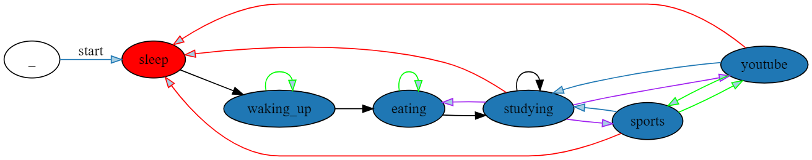

В діаграмі червоним кольором позначено початковий стан “sleep”.
Чорними стрілками позначено основні переходи між станами, які відбуваються коли немає випадкових івентів. 
Зелені стрілки відповідають за перехід між станами при випадкових подіях: коли стається івент “Air Alarm” в стані “eating” Трапезна закрита, тому персонаж знову повертається в стан “eating” у наступній годині; в стані “Waking up” коли стається івент “Air Alarm” або “Sudden attack of boredom”, персонаж залишається в ліжку і йде снідати лише через годину.
Фіолетовими стрілками позначено перехід у стани, коли певний показник персонажа стає нижчим за норму: якщо “food level”<1 зі стану “study” персонаж переходить в стан “eat”, якщо “motivation level”<2, то персонаж переходить у випадковий стан для підвищення рівня мотивації “sports” абл “youtube”, звідки назад переходить у “study”.
Червоні стрілки вказують на перехід до кінцевого стану “sleep”, коли на годиннику 23:00.

Загалом ціль персонажа провчитися максимальну кількість часу протягом дня, тому в ipynb файлі, є діаграма як ймовірність появиви випадкових подій впливає на кількість годин, що персонаж провів за навчанням за добу.
При звичайному запуску функції “main” в термінал постпово виводяться дані про годину, випадкову подію та стан в якому зараз знаходиться персонаж. При запуску функції “plot” будується графік на основі вірогідностей від 0 до 1, кожен випадок перевіряється на 500 днях для мінімізації статистичної похибки.
